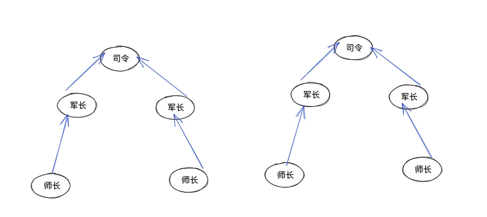
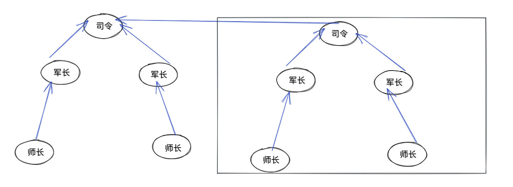

### 并查集

并查集是一种树型的数据结构，用于处理一些不相交集（Disjoint Sets）的合并及查找问题。有一个合并—查找算法（Union-find Algorithm）定义了两个用于此数据结构的操作：

> Find：确定元素属于哪一个子集，它可以被用来确定两个元素是否属于同一个子集。
>
> Union：将两个子集合并成一个集合。

由于支持这两种操作，一个不相交集也常被称为合并—查找数据结构（Union-find Data Structure）或合并—查找集合（Merge-find Set）。


#### 形象解释

比如有两个司令。 司令下有若干军长，军长下有若干师长。。。

我们如何判断某两个师长是否属于同一个司令呢（连通性）？

很简单，我们顺着师长，往上找，找到司令。 如果两个师长找到的是同一个司令，那么就属于同一个司令。我们用 parent[x] = y 表示 x 的 parent 是 y，通过不断沿着搜索 parent 搜索找到 root，然后比较 root 是否相同即可得出结论。

并查集还有一个是操作是`union`。即将两个集合合并为同一个。

如图有两个司令：



我们将其合并为一个联通域，最简单的方式就是直接将其中一个司令指向另外一个即可：



以上就是两个核心 API `find` 和 `union`， 的形象化解释，下面我们来看下代码实现。

```python
def init(p):
	parent.setdefault(p, p)
def find(p):
	while p != parent[p]:
		p = parent[p]
	return p
def union(p, q):
	p_parent = find(p)
	q_parent = find(q)
	if p_parent != q_parent:
	parent[p_parent] = q_parent

parent = {}
遍历集合：
	init(p)
```


#### 相关题目

[547. 朋友圈](https://leetcode-cn.com/problems/friend-circles/)

[721. 账户合并](https://leetcode-cn.com/problems/accounts-merge/)

[990. 等式方程的可满足性](https://leetcode-cn.com/problems/satisfiability-of-equality-equations/)

